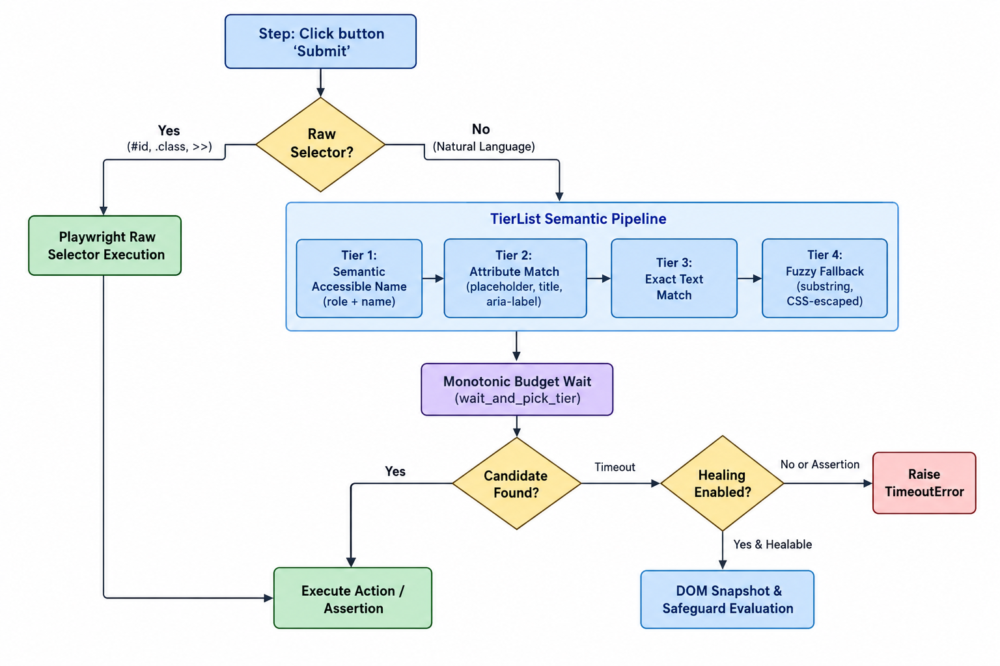

<div align="center">

# 📝 md-e2e

### *The Zero-Glue-Code, Markdown-Native E2E Test Automation Framework powered by Playwright*

[](https://github.com/contributors/md-e2e/actions)
[](https://pypi.org/project/md-e2e)
[](https://pypi.org/project/md-e2e)
[](https://github.com/astral-sh/ruff)
[](https://github.com/python/mypy)
[](LICENSE)

<br/>

<p align="center">
  <b>Write plain Markdown. Execute production-grade Playwright tests. Zero boilerplate required.</b>
</p>

<p align="center">
  <a href="#-why-md-e2e">Why md-e2e?</a> •
  <a href="#-architecture--locator-engine">Architecture</a> •
  <a href="#-quick-start">Quick Start</a> •
  <a href="#-dsl-reference">DSL Reference</a> •
  <a href="#-variables--dynamic-state">Variables & Matrix</a> •
  <a href="#%EF%B8%8F-self-healing-engine">Self-Healing</a> •
  <a href="#-custom-steps">Custom Steps</a> •
  <a href="#-reports--living-documentation">Reports</a> •
  <a href="#-pytest-integration">Pytest</a> •
  <a href="#%EF%B8%8F-cli-reference">CLI</a>
</p>

</div>

---

## 💡 Why md-e2e?

**md-e2e** bridges the gap between technical and non-technical stakeholders. It empowers developers, QA engineers, and product managers to author, review, and execute high-resilience browser automation directly in readable Markdown files.

| Feature / Metric | Cypress / Playwright | Cucumber / Behave | md-e2e |
| :--- | :---: | :---: | :---: |
| **Test Specification** | TypeScript / Python code | Gherkin `.feature` syntax | **Plain GitHub Markdown** |
| **Glue Code Required** | ❌ None (direct code) | 🔴 Heavy (step definition files + regex) | 🟢 **Zero glue code needed** |
| **Selector Resilience** | ⚠️ Manual selectors / test IDs | ⚠️ Rigid & brittle | 🛡️ **Multi-tier semantic locators** |
| **Self-Healing** | ❌ None | ❌ None | 🤖 **Built-in AI & heuristic healing** |
| **Collaborative Editing** | Engineers only | PMs write, engineers maintain | **Shared living documentation** |
| **Setup Overhead** | Moderate to High | High (multiple dependencies) | **Single command (`pip install md-e2e`)** |

### Core Capabilities
- 🚀 **Zero Glue Code**: Human-readable actions resolve directly to Playwright locators without step-definition boilerplate.
- 🎯 **Multi-Tier Semantic Locators**: Prioritizes accessible names and roles before falling back to titles, placeholders, or fuzzy text.
- ⚡ **Compound Selector Support**: Seamlessly use Playwright engines (`data-testid=`, `xpath=`, `css=`), CSS classes (`#id`, `.class`), and compound chains (`div >> input[type="text"]`).
- 🛡️ **Hybrid Self-Healing**: Resilient against UI refactors with 6 deterministic safeguards, assertion immunity, and DOM password redaction.
- 📊 **Data-Driven Matrix**: Run scenarios across Markdown tables with complete cross-row execution isolation.
- 🧰 **Built-in Developer Tools**: Includes an interactive step-by-step debugger and codegen browser recorder.

---

## 🏛️ Architecture & Locator Engine

md-e2e uses a multi-tier prioritized resolution model to locate DOM elements with high fidelity, preventing race conditions and fragile CSS selector failures.

<p align="center">
  
</p>

### Raw Selectors vs Natural Language
md-e2e understands when an identifier is a technical CSS/Playwright selector versus natural language text:

| Selector Pattern | Type | How md-e2e Resolves It |
| :--- | :---: | :--- |
| `button` / `#submit-btn` / `.btn-primary` | **CSS** | Direct CSS locator query |
| `input[type="email"]` / `[disabled]` | **Attribute** | Direct CSS attribute locator query |
| `div >> input[type="text"]` | **Chained** | Playwright compound selector chain |
| `css=button.primary` / `xpath=//button` | **Engine** | Direct Playwright engine locator |
| `data-testid="checkout-btn"` | **TestID** | Native `getByTestId` query |
| `[Save]` / `[Cancel]` / `Next >> Page` | **Text** | **Natural Language**: Escaped & matched semantically |

> [!NOTE]
> Natural language phrases containing brackets or arrows (such as `[Save]` or `Click >> Next`) are safely treated as plain text and will never accidentally trigger raw selector syntax errors.

---

## 🚀 Quick Start

### 1. Installation

```bash
pip install md-e2e
playwright install --with-deps chromium
```

### 2. Initialize Project

```bash
md-e2e init
```

This generates a standard test structure:
```text
tests/
├── sample.test.md    # Starter Markdown test suite
└── conftest.py       # Custom step registrations & fixtures
```

### 3. Write a Test (`tests/sample.test.md`)

```markdown
# Sample E2E Test Suite

## Verify Example Domain
- Navigate to "https://example.com"
- Assert heading "Example Domain" is visible
- Assert text "illustrative examples" is visible
- Assert link "More information..." is visible
```

### 4. Execute Tests

```bash
# Standard headless run
md-e2e run tests/

# Headed mode with 500ms action delay
md-e2e run tests/ --headed --slowmo 500

# Execute on a specific browser engine (chromium, firefox, webkit)
md-e2e run tests/ --browser firefox
```

---

## 📐 Test Spec Anatomy

A Markdown test file combines suite headings, tags, setup/teardown hooks, scenarios, and step lists:

````markdown
# E-Commerce Suite @smoke @checkout

```python setup
# Suite setup: runs once before all scenarios
store.store("BASE_URL", "https://shop.example.com")
```

## User Checkout @critical
- Navigate to "{{BASE_URL}}/cart"
- Fill input "Email" with "{{RANDOM_EMAIL}}"
- Click button "Checkout"
- Wait for URL contains "/confirmation"
- Assert heading "Order Confirmed" is visible
- Store text from heading "Order #" as "ORDER_ID"

```python teardown
# Scenario teardown: runs after scenario (even on failure)
print(f"Completed checkout order: {store.get('ORDER_ID')}")
```
````

---

## 📖 DSL Reference

All step verbs are case-insensitive. Element targets and values can be enclosed in double quotes (`"`), single quotes (`'`), or backticks (`` ` ``).

### Navigation & Page Actions
| Action | Example |
| :--- | :--- |
| `Navigate to "<url>"` / `Go to "<url>"` | `- Navigate to "https://example.com/login"` |
| `Reload page` / `Reload` | `- Reload page` |

### Clicks & Mouse Actions
| Action | Example |
| :--- | :--- |
| `Click button "<name>"` | `- Click button "Sign In"` |
| `Click link "<name>"` | `- Click link "Forgot Password?"` |
| `Click "<text>"` | `- Click "Terms of Service"` |
| `Click testid "<id>"` | `- Click testid "theme-toggle-btn"` |
| `Hover "<name>"` / `Hover over "<name>"` | `- Hover over "User Profile"` |
| `Hover testid "<id>"` | `- Hover testid "tooltip-trigger"` |

### Inputs & Forms
| Action | Example |
| :--- | :--- |
| `Fill input "<field>" with "<val>"` | `- Fill input "Email" with "user@test.com"` |
| `Fill "<field>" with "<val>"` | `- Fill "Password" with "Secret123!"` |
| `Fill testid "<id>" with "<val>"` | `- Fill testid "search-box" with "laptop"` |
| `Select "<option>" from "<dropdown>"` | `- Select "United States" from "Country"` |
| `Check checkbox "<name>"` / `Check "<name>"` | `- Check checkbox "Subscribe to newsletter"` |
| `Uncheck checkbox "<name>"` / `Uncheck "<name>"` | `- Uncheck checkbox "Remember Me"` |
| `Check testid "<id>"` / `Uncheck testid "<id>"` | `- Check testid "terms-agree"` |
| `Upload "<file>" to "<input>"` | `- Upload "fixtures/doc.pdf" to "Resume"` |
| `Press "<key>"` | `- Press "Enter"` or `- Press "Control+a"` |

### Assertions & Verifications
| Action | Example |
| :--- | :--- |
| `Assert heading "<txt>" is visible` | `- Assert heading "Dashboard" is visible` |
| `Assert button "<txt>" is visible` | `- Assert button "Submit" is visible` |
| `Assert text "<txt>" is visible` / `Assert "<txt>" is visible` | `- Assert text "Welcome back!" is visible` |
| `Assert testid "<id>" is visible` | `- Assert testid "cart-badge" is visible` |
| `Assert heading "<txt>" is hidden` / `Assert "<txt>" is hidden` | `- Assert "Loading spinner" is hidden` |
| `Assert testid "<id>" is hidden` | `- Assert testid "spinner" is hidden` |
| `Assert URL is "<url>"` / `contains "<str>"` / `matches "<regex>"` | `- Assert URL contains "/dashboard"` |
| `Assert title is "<title>"` / `contains "<str>"` | `- Assert title contains "Overview"` |
| `Assert input "<field>" value is "<val>"` / `contains "<val>"` | `- Assert input "Username" value is "admin"` |
| `Assert variable "<name>" is "<val>"` / `contains "<val>"` | `- Assert variable "STATUS" is "active"` |

### Waiting & Synchronization
| Action | Example |
| :--- | :--- |
| `Wait <N> seconds` | `- Wait 3 seconds` |
| `Wait for network idle` | `- Wait for network idle` |
| `Wait for URL contains "<str>"` / `is "<url>"` / `matches "<regex>"` | `- Wait for URL contains "/checkout"` |

### Variable Extraction
| Action | Example |
| :--- | :--- |
| `Store text from heading "<target>" as "<VAR>"` | `- Store text from heading "Total" as "TOTAL_PRICE"` |
| `Store text from "<target>" as "<VAR>"` | `- Store text from "Order ID" as "ORDER_ID"` |
| `Store text from testid "<id>" as "<VAR>"` | `- Store text from testid "order-num" as "ORDER_ID"` |

> [!TIP]
> When multiple elements match a target in `Store text`, md-e2e automatically prefers visible elements over hidden background duplicates before extracting text.

---

## 🔄 Variables & Dynamic State

Variables are interpolated using `{{VAR}}`, `{{ VAR }}`, or `${VAR}`.

### Dynamic Value Generators
- `{{RANDOM_STRING}}`: Generates a fresh 12-character random string (e.g. `k8f2m9x0w1q4`).
- `{{RANDOM_EMAIL}}`: Generates a unique email address (e.g. `test_9x2b4m1q@example.com`).
- `{{TIMESTAMP}}`: Current Unix epoch timestamp in seconds (e.g. `1740000000`).

### Environment Variables & State Pipeline
Prefix system environment variables with `ENV_`:
```markdown
- Navigate to "{{ENV_BASE_URL}}/login"
- Fill input "API Key" with "{{ENV_SECRET_KEY}}"
```

Pass extracted values between steps:
```markdown
- Click button "Generate API Key"
- Store text from heading "Key" as "API_KEY"
- Fill input "Authorization" with "{{API_KEY}}"
```

---

## 📊 Data-Driven Testing Matrix

Run scenarios across multiple parameter combinations by declaring a Markdown table directly under the scenario header:

```markdown
## User Login Matrix @data-driven
| username | password  | expected_status |
| alice    | pass123   | Welcome, Alice  |
| bob      | secret456 | Welcome, Bob    |

- Navigate to "https://example.com/login"
- Fill input "Username" with "{{username}}"
- Fill input "Password" with "{{password}}"
- Click button "Sign In"
- Assert text "{{expected_status}}" is visible
```

> [!IMPORTANT]
> **Complete Execution Isolation**: md-e2e performs deep AST copies across scenario runs and matrix rows. Parameter substitutions in one row cannot leak or mutate the steps of subsequent rows.

---

## 🛡️ Self-Healing Engine

When modern web apps undergo UI refactoring, locators can break. md-e2e includes a hybrid self-healing engine that detects locator timeouts, analyzes visible interactive elements, and suggests or applies automatic fixes.

### Production Safeguards
To prevent false-positive heals, md-e2e enforces 6 strict invariants:

1. **Similarity Threshold**: Candidate similarity ratio must be $\ge 0.70$.
2. **Strict Role Confinement**: Buttons only heal to buttons, inputs to inputs, links to links.
3. **Ambiguity Delta**: The top match score must lead the runner-up candidate by at least $0.12$.
4. **Opposing Verb Guard**: Never heals antonym actions (e.g., `Delete` $\neq$ `Save`, `Cancel` $\neq$ `Confirm`).
5. **Assertion Immunity**: All assertion steps (`Assert ...`) are strictly excluded from self-healing to prevent mutating test criteria.
6. **DOM Snapshot Redaction**: Password fields (`type="password"` or `autocomplete="*-password"`) are redacted to `<PASSWORD>` before being passed to LLM healing.

### Enabling AI / LLM Fallback (Tier 2)
Provide your OpenAI or compatible endpoint credentials:
```bash
# Environment variables
export OPENAI_API_KEY="sk-..."
export LLM_BASE_URL="http://localhost:11434/v1"  # Optional: Ollama, Azure, vLLM
export LLM_MODEL="llama3.1"                      # Optional: Model name
```
Or pass directly via CLI:
```bash
md-e2e run tests/ --llm-api-key "sk-..."
```

### Auto-Generated Git Patches
When healing resolves broken selectors, md-e2e outputs a standard `git apply`-compatible patch file:
```diff
--- a/tests/checkout.test.md
+++ b/tests/checkout.test.md
@@ -14,1 +14,1 @@
- - Click button "Proceed to Checkout"
+ - Click button "Complete Purchase"
```

---

## 🧩 Custom Steps

Extend the DSL with Python step handlers in `tests/conftest.py` (auto-discovered on execution):

```python
from md_e2e import custom_step

@custom_step(r'Clear all browser cookies')
async def clear_cookies(page):
    await page.context.clear_cookies()

@custom_step(r'Log in as user "(?P<email>[^"]+)" with role "(?P<role>[^"]+)"')
async def custom_login(page, email: str, role: str, store):
    await page.goto("https://example.com/login")
    await page.fill('[name="email"]', email)
    store.store("CURRENT_USER", email)
```

Use directly in your test specs:
```markdown
## Custom Step Scenario
- Clear all browser cookies
- Log in as user "admin@test.com" with role "Admin"
- Assert heading "Admin Dashboard" is visible
```

---

## 🐛 Debugger & Recorder

### Interactive Step Debugger
Step through actions in real time with visual highlights in the browser:
```bash
md-e2e run tests/sample.test.md --step
```
Interactive debugger key commands:
- `Enter`: Execute current step and advance
- `r`: Retry current step
- `e`: Edit current step on-the-fly
- `s`: Skip current step
- `q`: Quit execution

### Action Recorder (Codegen)
Generate clean Markdown test specs interactively by navigating your application:
```bash
md-e2e record "https://example.com" -o tests/recorded.test.md
```

---

## 📊 Reports & Living Documentation

Generate Markdown summaries for PR comments and interactive zero-dependency HTML dashboards:

```bash
md-e2e run tests/ --report-md summary.md --report-html report.html
```

- **`summary.md`**: GitHub PR comment-ready summary with test outcome badges and collapsible error traces.
- **`report.html`**: Interactive standalone dashboard with search filters, execution timestamps, embedded failure screenshots, and step timings.

---

## 🧪 Pytest Integration

All Markdown test suites are automatically collected and executed by `pytest`:

```bash
# Run all markdown tests
pytest -v

# Filter by tags (@smoke, @checkout)
pytest -m "smoke and not slow" -v

# Run with headed browser & custom step timeout
pytest --md-headed --md-timeout 15000
```

> [!NOTE]
> md-e2e hooks into pytest lifecycle events to guarantee that suite-level teardown code executes reliably even when runs are aborted with `-x`, filtered with `-k`, or terminated on failure.

---

## ⚙️ CLI Reference

### `md-e2e run`
```bash
md-e2e run <path> [options]
```

| Option | Type | Default | Description |
| :--- | :--- | :--- | :--- |
| `path` | Argument | *(required)* | Path to Markdown test file or directory |
| `--headed` | Flag | `False` | Run with visible browser window |
| `--browser` | Choice | `chromium` | Browser engine (`chromium`, `firefox`, `webkit`) |
| `--slowmo` | Integer | `0` | Delay between actions in milliseconds |
| `--timeout` | Integer | `30000` | Step timeout budget in milliseconds |
| `--step` | Flag | `False` | Launch interactive step debugger |
| `--healing / --no-healing` | Flag | `True` | Toggle self-healing engine |
| `--clean-session` | Flag | `False` | Isolate variable store between scenarios |
| `--verbose / -v` | Flag | `False` | Display detailed step execution and debug logs |
| `--llm-api-key` | String | `None` | API key for LLM healing fallback |
| `--report-md` | Path | `None` | Path to export GitHub-flavored Markdown report |
| `--report-html` | Path | `None` | Path to export interactive HTML dashboard |

### Auxiliary Commands
- `md-e2e init`: Scaffolds a starter `tests/` directory with sample tests and `conftest.py`.
- `md-e2e record <url> [-o out.test.md]`: Launches browser recorder to generate Markdown test steps.
- `md-e2e info <path>`: Inspects Markdown suites, displaying scenarios, steps, and tags.

---

## 🤖 CI/CD Integration

### GitHub Actions Workflow (`.github/workflows/e2e.yml`)

```yaml
name: E2E Tests
on: [push, pull_request]

jobs:
  test:
    runs-on: ubuntu-latest
    steps:
      - uses: actions/checkout@v4
      
      - uses: actions/setup-python@v5
        with:
          python-version: '3.12'
          
      - name: Install dependencies
        run: |
          pip install md-e2e
          playwright install --with-deps chromium
          
      - name: Run E2E Tests
        run: md-e2e run tests/ --report-md summary.md --report-html report.html
        env:
          OPENAI_API_KEY: ${{ secrets.OPENAI_API_KEY }}
          
      - name: Publish Test Summary
        if: always()
        run: cat summary.md >> $GITHUB_STEP_SUMMARY
        
      - name: Upload HTML Report
        if: always()
        uses: actions/upload-artifact@v4
        with:
          name: html-report
          path: report.html
```

---

## 💬 Quoting & CSS Escaping

| Syntax Pattern | Purpose | Example |
| :--- | :--- | :--- |
| `"..."` | Standard double quotes | `- Click button "Login"` |
| `'...'` | Single quotes for strings containing double quotes | `- Assert text 'Results for "Shoes"' is visible` |
| `` `...` `` | Backticks for complex nested quotes | `` - Assert text `User "John's" Profile` is visible `` |
| `\"` | Escaped quotes within double-quoted strings | `- Assert text "Results for \"Shoes\"" is visible` |

> [!TIP]
> Special characters in element names (including slashes, brackets, colons, quotes, newlines, and form feeds) are safely escaped through canonical CSS serialization, ensuring robust live Playwright execution.

---

## ❓ Troubleshooting

| Issue | Cause | Solution |
| :--- | :--- | :--- |
| `Executable doesn't exist` | Playwright browser binaries missing | Run `playwright install --with-deps chromium` |
| `StepNotImplementedError` | DSL step not recognized | Check spelling or register regex in `tests/conftest.py` |
| Dynamic SPA rendering lag | Element mounting asynchronously | md-e2e automatically waits up to the timeout budget; use `Wait for URL contains "..."` or `Wait for network idle` if needed |
| Cascading `<select>` timeout | Dropdown options load dynamically | md-e2e uses monotonic deadline budgeting; ensure the `<select>` has an accessible label, name, or ID |
| Windows console encoding | UTF-8 characters in terminal | md-e2e includes native UTF-8 stdout wrapping on Windows |

---

## 🤝 Contributing

```bash
# Clone the repository
git clone https://github.com/contributors/md-e2e.git
cd md-e2e

# Setup virtual environment
python -m venv venv
source venv/bin/activate  # Windows: .\venv\Scripts\Activate.ps1

# Install dependencies and browsers
pip install -e ".[dev]"
playwright install --with-deps chromium

# Run the test suite
pytest -v
```

---

## 📄 License

Distributed under the **MIT License**. See [LICENSE](LICENSE) for details.
