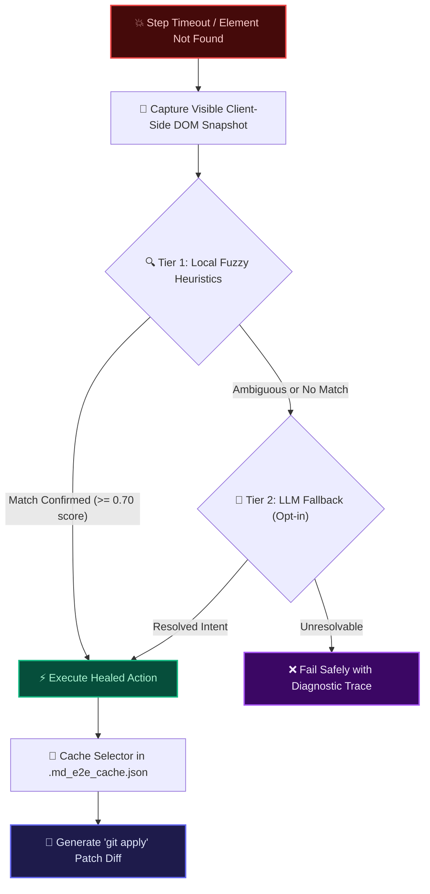

<div align="center">

# 📝 md-e2e

### *The Zero-Glue-Code, Markdown-Native E2E Test Automation Framework powered by Playwright*

[](https://github.com/contributors/md-e2e/actions)
[](https://pypi.org/project/md-e2e)
[](https://pypi.org/project/md-e2e)
[](https://github.com/astral-sh/ruff)
[](https://github.com/python/mypy)
[](LICENSE)

<br/>

<p align="center">
  <b>Write plain Markdown. Run production-grade Playwright tests. Zero boilerplate required.</b>
</p>

<p align="center">
  <a href="#-why-md-e2e">Why md-e2e?</a> •
  <a href="#-beginner-tutorial-step-by-step">Beginner Tutorial</a> •
  <a href="#-markdown-dsl-reference">DSL Reference</a> •
  <a href="#-variable-store--dynamic-state">Variables</a> •
  <a href="#-self-healing--ai-fallback">Self-Healing</a> •
  <a href="#-step-debugger--action-recorder">Debugger & Recorder</a> •
  <a href="#-living-documentation--reports">Reporting</a> •
  <a href="#-pytest-integration">Pytest</a>
</p>

</div>

---

## 💡 Why md-e2e?

Traditional End-to-End (E2E) testing frameworks suffer from a massive **Glue-Code Burden**:

| Framework | Test Format | Glue Code Required? | Resilience | Maintenance Overhead |
| :--- | :--- | :---: | :---: | :---: |
| **Cypress / Playwright (Code)** | TypeScript / Python | ❌ Direct Code | ⚠️ Manual Selectors | 🔴 High (Technical silos, PMs can't edit) |
| **Cucumber / Behave (BDD)** | Gherkin `.feature` | 🔴 **Heavy** (Regex steps for *every* sentence) | ⚠️ Brittle | 🔴 High (Dual maintenance: specs + steps) |
| **md-e2e (Markdown Native)** | **Plain Markdown `.md`** | 🟢 **Zero Glue Code** | 🛡️ **Self-Healing + AI Fallback** | 🟢 **Minimal** (Readable by PMs, executed by engineers) |

### The md-e2e Advantage
1. **Readable by Everyone**: Product Managers, QA analysts, and Software Engineers collaborate on the exact same Markdown file.
2. **Zero Step Definitions**: If you write `- Click button "Sign In"`, the framework resolves the element using accessibility heuristics without writing a single line of Python/JS glue code.
3. **Self-Healing Safeguards**: When frontend engineers tweak button text or redesign UI layouts, our hybrid heuristic & LLM engine heals selectors on-the-fly and outputs `git apply`-compatible patch diffs.
4. **Zero-Overhead**: Executes with **~0% overhead** compared to hand-written async Playwright scripts.

---

## 🔰 Beginner Tutorial: Step-by-Step

Welcome! If you are new to `md-e2e`, follow this step-by-step guide to get up and running in less than 3 minutes.

### Step 1: Install md-e2e and Browsers

Ensure you have Python 3.11 or newer installed, then run:

```bash
pip install md-e2e
playwright install --with-deps chromium
```

---

### Step 2: Scaffold Your Test Suite

Run the `init` command in your terminal:

```bash
md-e2e init
```

This creates the recommended directory layout:
```text
my-project/
├── tests/
│   ├── sample.test.md    # Starter Markdown test suite
│   └── conftest.py       # Custom step registrations & Pytest fixtures
└── pyproject.toml
```

---

### Step 3: Understand the Spec Anatomy

Open `tests/sample.test.md`. A test file is simply standard Markdown:

````markdown
# E-Commerce Checkout Suite @smoke @checkout

This suite verifies user checkout flows and order confirmations.

```python setup
# Suite-level setup hook (runs once before all scenarios)
store.store("STORE_URL", "https://demo.playwright.dev/todomvc")
```

## Place an Order Scenario @critical
- Navigate to "{{STORE_URL}}"
- Fill input "What needs to be done?" with "Buy groceries"
- Press "Enter"
- Check checkbox "Toggle Todo"
- Assert text "1 item left" is visible
- Store text from heading "todos" as "PAGE_TITLE"
- Assert title contains "{{PAGE_TITLE}}"

```python teardown
# Scenario-level cleanup hook (always runs, even on failure)
print("Scenario completed!")
```
````

#### Anatomy Breakdown:
1. `# Heading 1`: Defines the **Suite Name**. Tags (e.g. `@smoke`) allow test filtering.
2. ````python setup`: An optional Python hook to initialize state or prepare database fixtures.
3. `## Heading 2`: Defines an isolated **Test Scenario**.
4. `- Bullet List`: Each bullet point is a **Test Step** executed sequentially.
5. `{{STORE_URL}}`: Dynamic variable interpolation.

---

### Step 4: Run Your Tests

You can execute tests using either the standalone CLI tool or Pytest:

#### Option A: Using the Standalone CLI
```bash
# Run all tests in headless mode
md-e2e run tests/

# Run with a visible browser window (headed) and slowed actions (500ms delay)
md-e2e run tests/ --headed --slowmo 500

# Run a specific browser engine (chromium, firefox, webkit)
md-e2e run tests/ --browser firefox
```

#### Option B: Using Pytest
```bash
# Run all Markdown tests using pytest
pytest -v

# Filter tests by tags/markers
pytest -m "smoke and not slow" -v

# Run headed with custom timeouts
pytest --md-headed --md-timeout 10000
```

---

### Step 5: Interactive Step Debugging

If a test is behaving unexpectedly, activate the **Interactive Step Debugger**:

```bash
md-e2e run tests/sample.test.md --step
```

When paused at a step:
*   The target element is **visually highlighted with a red box** in the browser.
*   Terminal prompt options:
    *   `[Enter]`: Execute the current step and proceed to the next one.
    *   `r`: **Retry** current step (e.g., after you manually modify something in the browser).
    *   `e`: **Edit** the step text on-the-fly and execute the new command.
    *   `s`: **Skip** the current step.
    *   `q`: **Quit** execution immediately.

---

### Step 6: Generate Rich Reports

Generate shareable Markdown PR summaries and interactive HTML dashboards:

```bash
md-e2e run tests/ --report-md summary.md --report-html report.html
```

Open `report.html` in your browser to inspect test status filters, search queries, visual step timelines, embedded screenshots, video recordings, and Playwright trace files!

---

## 📖 Markdown DSL Reference

`md-e2e` parses steps with case-insensitive natural English vocabulary. Quotes can be double (`"`), single (`'`), or backticks (`` ` ``).

### Complete Grammar & Action Reference

| Category | Action Verb & Syntax | What it Does Behind the Scenes | Example |
| :--- | :--- | :--- | :--- |
| **Navigation** | `Navigate to "<url>"`<br/>`Go to "<url>"` | `page.goto(url, wait_until="domcontentloaded")` | `- Navigate to "https://example.com/login"` |
| | `Reload page`<br/>`Reload` | `page.reload()` | `- Reload page` |
| **Clicks** | `Click button "<name>"` | Matches `<button>`, `role="button"`, submit inputs | `- Click button "Log In"` |
| | `Click link "<name>"` | Matches `<a>` links and `role="link"` | `- Click link "Forgot Password?"` |
| | `Click "<text>"` | Semantic fallback: label, placeholder, button, text | `- Click "Terms of Service"` |
| **Input Fields** | `Fill input "<field>" with "<val>"` | Resolves label/placeholder/role, clears & types | `- Fill input "Email" with "user@test.com"` |
| | `Fill "<field>" with "<val>"` | Semantic input fallback | `- Fill "Password" with "Secret123!"` |
| **Selections** | `Select "<option>" from "<dropdown>"` | `locator.select_option(label=option)` | `- Select "United States" from "Country"` |
| **Toggles** | `Check checkbox "<name>"` | `locator.check()` | `- Check checkbox "Subscribe to newsletter"` |
| | `Uncheck checkbox "<name>"` | `locator.uncheck()` | `- Uncheck checkbox "Remember Me"` |
| **Mouse/Keys** | `Hover over "<name>"` | `locator.hover()` | `- Hover over "User Profile Avatar"` |
| | `Press "<Key>"` | `page.keyboard.press(key)` | `- Press "Enter"`<br/>`- Press "Tab"` |
| | `Upload "<file>" to "<input>"` | `locator.set_input_files(path)` | `- Upload "assets/doc.pdf" to "File Upload"` |
| **Assertions** | `Assert heading "<txt>" is visible` | Verifies `<h1>`-`<h6>` or `role="heading"` is visible | `- Assert heading "Dashboard" is visible` |
| | `Assert button "<txt>" is hidden` | Verifies element is hidden / detached | `- Assert button "Delete Account" is hidden` |
| | `Assert URL is "<url>"`<br/>`Assert URL contains "<url>"`<br/>`Assert URL matches "<regex>"` | Asserts current page URL | `- Assert URL contains "/dashboard"`<br/>`- Assert URL matches "https://.*/app"` |
| | `Assert title is "<title>"`<br/>`Assert title contains "<title>"` | Asserts browser tab document title | `- Assert title is "Home - My App"` |
| | `Assert input "<field>" value is "<val>"`<br/>`Assert input "<field>" value contains "<val>"` | Asserts text inside `<input>` or `<textarea>` | `- Assert input "Username" value is "admin"` |
| **State/Time** | `Wait <number> seconds` | `page.wait_for_timeout(ms)` | `- Wait 3 seconds` |
| | `Wait for network idle` | `page.wait_for_load_state("networkidle")` | `- Wait for network idle` |
| | `Store text from <type> "<target>" as "<VAR>"` | Reads text content and saves it into `VariableStore` | `- Store text from heading "Price" as "TOTAL"` |

---

### Data-Driven Parameterized Matrix

Create repeated data-driven tests by adding a standard Markdown table under the scenario heading:

```markdown
## User Login Matrix @data-driven
| username | password | expected_status |
| alice    | pass123  | Welcome back    |
| bob      | pass456  | Welcome back    |
| charlie  | wrong    | Invalid credentials |

- Navigate to "https://example.com/login"
- Fill input "Username" with "{{username}}"
- Fill input "Password" with "{{password}}"
- Click button "Sign In"
- Assert text "{{expected_status}}" is visible
```
*`md-e2e` automatically runs the scenario 3 times, once for each row in the table!*

---

## 🔄 Variable Store & Dynamic State

`md-e2e` includes an interpolation engine supporting both Jinja-style (`{{VAR}}`) and Shell-style (`${VAR}`) expressions.

### 1. Built-in Generators
Generate fresh test data dynamically without hardcoding:
*   `{{RANDOM_STRING}}`: Produces a random 12-character alphanumeric string (e.g. `k8f2m9x0w1q4`).
*   `{{RANDOM_EMAIL}}`: Produces a unique test email (e.g. `test_9x2b4m1q@example.com`).
*   `{{TIMESTAMP}}`: Produces current epoch seconds as a string (e.g. `1740000000`).

### 2. Environment Variables
Access system environment variables automatically with the `ENV_` prefix:
```markdown
- Navigate to "{{ENV_STAGING_URL}}"
- Fill input "API Key" with "{{ENV_API_SECRET_KEY}}"
```

### 3. Cross-Step State Pipelines
Capture text dynamically from one step and reuse it in downstream steps:
```markdown
- Store text from heading "Order Reference Number" as "ORDER_ID"
- Navigate to "https://example.com/orders"
- Fill input "Search Orders" with "{{ORDER_ID}}"
- Click button "Find"
- Assert text "Order #{{ORDER_ID}} Confirmed" is visible
```

---

## 🛡️ Self-Healing & AI Fallback Engine

Frontend UI refactors (renamed buttons, updated CSS classes, changed accessibility labels) frequently break conventional automation suites. `md-e2e` features a **Hybrid 2-Tier Self-Healing Engine** designed to maintain test stability without masking real application bugs.



---

### 🔒 5 Critical Production Safeguards

To prevent false positives, `md-e2e` enforces strict deterministic validation before any heal is applied:

| Safeguard | Rule & Threshold | Example Scenario & Behavior |
| :--- | :--- | :--- |
| **1. Similarity Threshold** | Confidence score must be $\ge 0.70$ (`difflib.SequenceMatcher`). | `"Submit Payment"` $\rightarrow$ `"Make Payment"` heals ($0.74$). Random strings are rejected. |
| **2. Role & Tag Confinement** | Target elements must strictly preserve their semantic HTML tag/role. | A `button "Submit"` step will **only** match buttons (`<button>`, `input[type=submit]`, `[role=button]`), never `<a>` or `<div>`. |
| **3. Ambiguity Delta** | Best candidate must lead 2nd candidate by $\ge 0.12$ margin. | If `Candidate A` scores $0.81$ and `Candidate B` scores $0.76$ ($\Delta = 0.05$), the engine refuses to guess and fails safely. |
| **4. Opposing Verb Guard** | Never match conflicting antonym actions. | Prevents dangerous mix-ups: `Save` $\ne$ `Delete`, `Cancel` $\ne$ `Confirm`, `Next` $\ne$ `Back`. |
| **5. Negative Assertion Bypass** | Negative assertions never trigger healing. | `Assert button "Delete" is hidden` never searches for alternative buttons to prevent false passes on deleted data. |

### 🤖 Configuring Level 2 (LLM) Fallback

Level 2 AI Fallback activates **only** when Level 1 local heuristics cannot find a confident match. You can configure the LLM provider using any of the following 4 methods:

#### Method 1: Environment Variables (Recommended for CI/CD & Local Dev)
Set your API key in your terminal or CI/CD secrets. `md-e2e` automatically checks for `OPENAI_API_KEY` or `MD_LLM_API_KEY`:
```bash
# Linux / macOS / GitHub Actions
export OPENAI_API_KEY="sk-proj-your-api-key-here"

# Windows PowerShell
$env:OPENAI_API_KEY="sk-proj-your-api-key-here"
```

#### Method 2: Standalone CLI Flag (`--llm-api-key`)
Pass the key directly during CLI execution:
```bash
md-e2e run tests/ --llm-api-key "sk-proj-your-api-key-here"
```

#### Method 3: Pytest Flag (`--md-llm-api-key`)
Pass the key during Pytest execution:
```bash
pytest --md-llm-api-key "sk-proj-your-api-key-here" -v
```

#### Method 4: Custom AI Model / Provider (`@set_llm_handler`)
To use **Google Gemini**, **Anthropic Claude**, **DeepSeek**, or a local **Ollama** instance, register a custom handler in `tests/conftest.py`:
```python
# tests/conftest.py
import requests
from md_e2e import set_llm_handler

@set_llm_handler
def custom_ai_healer(step_text: str, visible_elements: list[dict]) -> str:
    """Custom LLM Resolver (e.g., using local Ollama or Claude/Gemini)."""
    prompt = (
        f"A test step timed out: {step_text}\n"
        f"Visible elements: {visible_elements}\n"
        f"Return ONLY the exact text or label of the matching element."
    )
    # Example calling local Ollama (Llama 3)
    resp = requests.post(
        "http://localhost:11434/api/generate",
        json={"model": "llama3", "prompt": prompt, "stream": False}
    )
    return resp.json().get("response", "").strip()
```

### Git Patch Output
At the conclusion of the test run, `md-e2e` outputs a valid `git apply` patch for all healed selectors:
```diff
--- a/tests/checkout.test.md
+++ b/tests/checkout.test.md
@@ -14,3 +14,3 @@
- - Click button "Proceed to Checkout"
+ - Click button "Complete Purchase"
```
Apply the healed changes to your codebase with:
```bash
git apply healed_diff.patch
```

---

## 📹 Codegen Action Recorder

Don't want to type Markdown steps manually? Use the built-in **Action Recorder**:

```bash
md-e2e record "https://example.com" -o tests/recorded.test.md
```

1. An interactive headed browser will open.
2. Click buttons, fill forms, check checkboxes, and navigate pages.
3. Every action is translated in real-time into clean Markdown DSL.
4. When finished, simply close the browser window. Your formatted `.test.md` file is saved automatically!

---

## 🧩 Extending with Custom Steps

Need to execute custom database seeding, API calls, or complex Playwright logic? Register custom steps in `tests/conftest.py`:

```python
import pytest
from md_e2e import custom_step

@custom_step(r'Log in as user "(?P<email>[^"]+)" with role "(?P<role>[^"]+)"')
async def custom_login_handler(page, email: str, role: str, store, db_connection):
    # 1. Access regex capture groups (email, role)
    # 2. Inject Playwright 'page' or 'store'
    # 3. Inject any standard Pytest fixture (e.g., db_connection)
    token = await db_connection.generate_auth_token(email, role)
    await page.goto("https://example.com/app")
    await page.evaluate(f"localStorage.setItem('auth_token', '{token}')")
    store.store("CURRENT_USER", email)
```

Now you can use this natural phrase anywhere in your Markdown files:
```markdown
- Log in as user "admin@company.com" with role "SuperAdmin"
- Assert heading "Admin Dashboard" is visible
```

---

## 📊 Living Documentation & CI/CD Reports

`md-e2e` transforms raw test executions into rich, visual reports for product managers, engineering leads, and QA teams.

### 1. Markdown Pull Request Summary (`summary.md`)
Generated with `--report-md summary.md`, perfect for posting directly to GitHub PR comments or Notion:

```markdown
# 📊 Markdown E2E Test Execution Summary

 **`4/4` Scenarios Passed** in `4.12s`

| Suite | Total | Passed | Failed | Healed | Duration |
| :--- | :---: | :---: | :---: | :---: | :---: |
| `Auth Suite` | 2 | 2 | 0 | 1 | 2.10s |
| `Checkout Suite` | 2 | 2 | 0 | 0 | 2.02s |

## 📋 Scenario Execution Details
### 📂 Suite: `Auth Suite`
- [x] **User Login** (`850.2ms`) [HEALED]
  - [x] - Navigate to "https://example.com/login"
  - [x] - Click button "Log In" 🛡️ *(Healed)*
```

### 2. Zero-Dependency HTML Dashboard (`report.html`)
Generated with `--report-html report.html`:
*   **Theme**: Dark/Light mode with responsive modern aesthetics.
*   **Filters**: Real-time filtering by status (`All`, `Passed`, `Failed`, `Healed`) and dynamic search bar.
*   **Media Embeds**: Embedded failure screenshots and full HTML5 video playback.
*   **Diagnostics**: Collapsible console logs and Playwright Trace Viewer download links (`trace.zip`).

---

## ⚙️ Configuration & CLI Reference

### `md-e2e run` CLI Flags

| Flag | Type | Default | Description |
| :--- | :--- | :--- | :--- |
| `path` | Argument | `tests/` | Path to a `.test.md` file or directory of tests. |
| `--headed` | Boolean | `False` | Run browser in headed mode with visible UI. |
| `--browser` | Choice | `chromium` | Target browser engine: `chromium`, `firefox`, or `webkit`. |
| `--slowmo` | Integer | `0` | Delay between Playwright actions in milliseconds. |
| `--timeout` | Integer | `30000` | Action & assertion timeout in milliseconds. |
| `--step` | Boolean | `False` | Enable the interactive step-by-step debugger. |
| `--healing / --no-healing` | Boolean | `True` | Toggle the Self-Healing heuristic engine. |
| `--llm-api-key` | String | `None` | API key for Level 2 LLM self-healing fallback (e.g. OpenAI / OpenRouter). |
| `--report-md` | Path | `None` | Output filepath for the Markdown PR summary report. |
| `--report-html` | Path | `None` | Output filepath for the interactive HTML dashboard. |

### `pytest` Flags

| Pytest Flag | Description |
| :--- | :--- |
| `--md-headed` | Run browser tests in headed mode. |
| `--md-browser [engine]` | Target browser engine (`chromium`, `firefox`, `webkit`). |
| `--md-timeout [ms]` | Set Playwright timeout in milliseconds. |
| `--md-slow-mo [ms]` | Set delay between actions in milliseconds. |
| `--md-screenshot-dir [dir]` | Directory to save failure screenshots. |
| `--md-trace-dir [dir]` | Directory to save Playwright trace archives (`.zip`). |
| `--md-no-healing` | Disable the self-healing fallback engine. |
| `--md-llm-api-key [key]` | API key for Level 2 LLM self-healing fallback. |
| `--md-report-md [path]` | Generate Markdown summary report upon session completion. |
| `--md-report-html [path]` | Generate interactive HTML dashboard upon session completion. |

---

## 🤖 GitHub Actions CI/CD Integration

Add `.github/workflows/e2e.yml` to run your Markdown test suite automatically on every pull request:

```yaml
name: Markdown E2E Automated Tests

on:
  push:
    branches: [ main, master ]
  pull_request:
    branches: [ main, master ]

jobs:
  e2e:
    runs-on: ubuntu-latest
    steps:
      - name: Checkout Code
        uses: actions/checkout@v4

      - name: Set up Python 3.12
        uses: actions/setup-python@v5
        with:
          python-version: '3.12'

      - name: Install Dependencies
        run: |
          pip install --upgrade pip
          pip install md-e2e
          playwright install --with-deps chromium

      - name: Execute Markdown E2E Test Suites
        run: |
          md-e2e run tests/ --report-md summary.md --report-html report.html || true

      - name: Publish Test Summary to PR Step Summary
        if: always()
        run: |
          if [ -f summary.md ]; then
            cat summary.md >> $GITHUB_STEP_SUMMARY
          fi

      - name: Upload HTML Dashboard Artifact
        if: always()
        uses: actions/upload-artifact@v4
        with:
          name: e2e-html-report
          path: report.html
```

---

## 🤝 Contributing

Contributions are welcome! To set up the development environment:

```bash
git clone https://github.com/contributors/md-e2e.git
cd md-e2e
python -m venv venv
source venv/bin/activate  # Or .\venv\Scripts\Activate.ps1 on Windows
pip install -e .[dev]
playwright install --with-deps chromium
pytest -v
```

---

## 📄 License

This project is licensed under the **MIT License** — see the [LICENSE](LICENSE) file for details.
