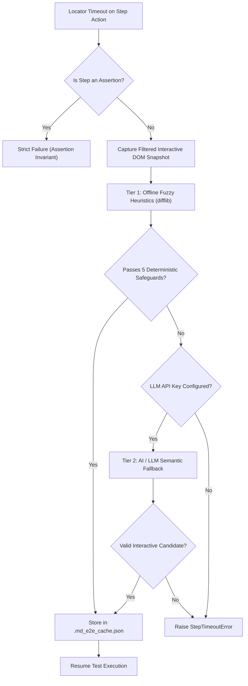

# Self-Healing & AI Fallback Engine

Web application user interfaces evolve constantly. When minor layout tweaks, copy revisions, or attribute updates break traditional test automation scripts, md-e2e intercepts locator timeouts and automatically resolves the intended element through a resilient, multi-tiered self-healing engine.

---

## 🛡️ Two-Tier Healing Architecture



### Tier 1: Local Fuzzy Heuristics (Offline)
Runs locally without network requests or external dependencies:
1. Filters visible interactive elements in the viewport matching the requested `TargetType`.
2. Computes similarity scores against visible labels, text content, placeholders, and test IDs using `difflib.SequenceMatcher`.
3. Validates candidates against deterministic production safeguards.

### Tier 2: AI / LLM Semantic Fallback (Optional)
If local heuristics fail to find a clear winner and an LLM API key is provided:
1. Passes a sanitized DOM snapshot (with sensitive data redacted) to the configured model.
2. The model analyzes the intent of the step in context and returns the target selector.
3. If confirmed valid, execution resumes seamlessly.

---

## 🔒 Production Safeguards

Automated self-healing must never introduce false-positive test passes. md-e2e enforces 6 strict invariants:

1. **Similarity Threshold**: Candidate similarity ratio must be $\ge 0.70$.
2. **Strict Role Confinement**: Buttons only heal to buttons (`<button>`, `role="button"`), inputs to inputs (`<input>`, `<textarea>`), links to links (`<a>`).
3. **Ambiguity Delta**: The top candidate score must lead the runner-up candidate by at least $0.12$ to prevent arbitrary guesses in dense UIs.
4. **Opposing Verb Guard**: Explicitly rejects matching antonym actions (e.g., `Delete` $\neq$ `Save`, `Cancel` $\neq$ `Confirm`, `Remove` $\neq$ `Add`).
5. **Assertion Immunity**: All assertion steps (`Assert ... is visible`, `Assert ... is hidden`, `Assert value ...`) are **strictly excluded from self-healing**. Assertions define acceptance criteria and must remain invariant.
6. **DOM Snapshot Password Redaction**: Fields with `type="password"` or `autocomplete="*-password"` have their values redacted to `<PASSWORD>` before snapshots are processed or sent to LLMs.

---

## 💾 Deterministic Local Caching

Healed selectors are cached in `.md_e2e_cache.json` using deterministic hash keys:

```json
{
  "Auth Suite::User Checkout::14::Click button 'Proceed to Payment'": "Complete Order"
}
```

- Subsequent runs reuse cached healed selectors instantly with zero healing overhead.
- If a cached selector ever fails on future runs, md-e2e automatically invalidates (busts) the entry and triggers the full healing pipeline again.

---

## 📝 Auto-Generated Git Patches

At the conclusion of a test run, all healed steps produce a clean, `git apply`-compatible patch file:

```diff
--- a/tests/checkout.test.md
+++ b/tests/checkout.test.md
@@ -14,1 +14,1 @@
- - Click button "Proceed to Payment"
+ - Click button "Complete Order"
```

Developers can review the diff and apply fixes with a single command:
```bash
git apply healed_steps.patch
```

---

## ⚙️ AI Fallback Configuration

Set your API key and optional custom endpoint parameters via environment variables:

```bash
# Standard OpenAI
export OPENAI_API_KEY="sk-..."

# Custom Local or Enterprise Endpoints (Ollama, Azure OpenAI, vLLM)
export LLM_BASE_URL="http://localhost:11434/v1"
export LLM_MODEL="llama3.1"
```

Or provide via CLI:
```bash
md-e2e run tests/ --llm-api-key "sk-..."
```
