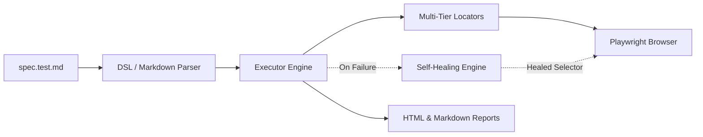

# Welcome to md-e2e

<div align="center">

### *The Zero-Glue-Code, Markdown-Native E2E Test Automation Framework powered by Playwright*

[](https://github.com/contributors/md-e2e/actions)
[](https://pypi.org/project/md-e2e)
[](https://pypi.org/project/md-e2e)
[](LICENSE)

</div>

---

## 🌟 Overview

**md-e2e** bridges the gap between technical and non-technical stakeholders. It executes human-readable specifications written in plain Markdown directly as robust, production-grade Playwright browser tests.

Unlike traditional BDD frameworks like Cucumber or Behave, md-e2e requires **zero step-definition glue code**. Actions and assertions are automatically parsed and dynamically mapped to Playwright locators using an intelligent, multi-tier semantic resolution engine.

---

## 🚀 Key Features

- **📝 Markdown-Native Specifications**: Author tests in clean GitHub Markdown using lists, tables, and setup blocks.
- **🎯 Multi-Tier Semantic Locators**: Prioritizes ARIA accessible names and roles before falling back to titles, placeholders, or fuzzy text.
- **⚡ Compound & Raw Selectors**: Native support for CSS selectors (`#id`, `.class`), chained combinators (`div >> input[type="text"]`), and Playwright engines (`data-testid=`, `xpath=`, `css=`).
- **🛡️ Hybrid Self-Healing Engine**: Offline heuristic scoring and optional AI/LLM fallback with strict production safeguards (assertion immunity, role confinement, password redaction).
- **📊 Data-Driven Matrix**: Run test scenarios across Markdown tables with complete cross-row execution isolation.
- **⏱️ Monotonic Timeout Budgeting**: Eliminates timeout cascades in dropdowns and asynchronous element mounting.
- **📈 Living Documentation & Reports**: Generates PR-ready Markdown summaries and interactive, zero-dependency HTML dashboards.
- **🧪 Pytest Integration**: Seamless discovery and execution under standard `pytest` test runners.

---

## 🏛️ How It Works



1. **Parse**: Markdown test suites and scenarios are parsed into abstract syntax trees (ASTs).
2. **Resolve**: Natural language verbs are mapped to Playwright actions, using semantic tiers to find the most accurate element.
3. **Execute**: Runs actions within isolated browser contexts (clean cookies and storage state).
4. **Heal**: If an element changed during a UI refactor, offline heuristics or AI suggest verified corrections.
5. **Report**: Generates test summaries, embedded failure screenshots, and step timelines.

---

## ⚡ Quick Example

Create a file named `tests/sample.test.md`:

```markdown
# Sample E2E Test Suite @smoke

## Verify Example Domain
- Navigate to "https://example.com"
- Assert heading "Example Domain" is visible
- Assert text "illustrative examples" is visible
- Click link "More information..."
- Assert URL contains "iana.org"
```

Run it immediately with:

```bash
md-e2e run tests/
```

---

## 📚 Documentation Sections

- [**Markdown DSL Reference**](dsl.md): Complete vocabulary guide for navigation, clicks, inputs, dropdowns, assertions, variables, and data-driven matrix tables.
- [**Standalone CLI**](cli.md): Options for `md-e2e run`, `init`, `record`, and the interactive step debugger.
- [**Self-Healing Engine**](healing.md): Offline heuristics, AI fallback configuration, production safeguards, and Git patch generation.
- [**CI/CD & Reporting**](reporting.md): PR summary comments, interactive HTML dashboards, and GitHub Actions integration.
